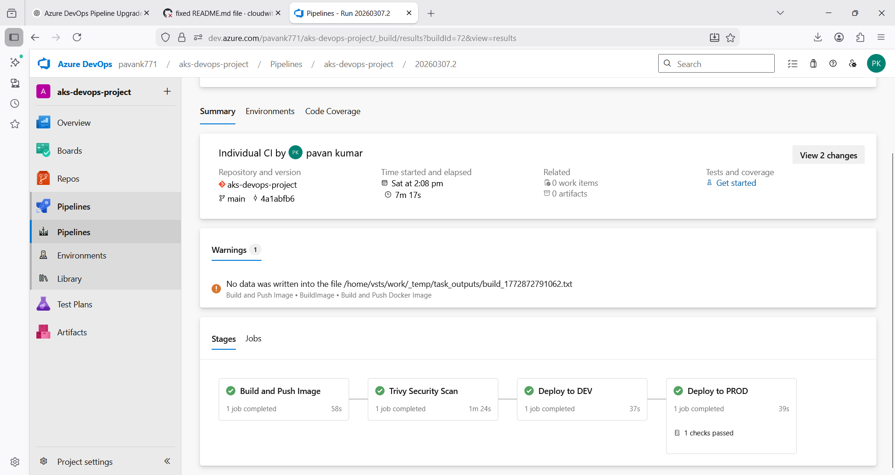

# 🚀 End-to-End DevOps Platform on Azure AKS

### CI/CD • Terraform • Trivy Security Scanning • Prometheus • Grafana • Kubernetes

This project demonstrates a **production-style DevOps platform built on Azure Kubernetes Service (AKS)**.

It implements a complete **CI/CD pipeline**, **container security scanning**, **monitoring**, **autoscaling**, and **infrastructure provisioning using Terraform**.

The platform deploys a **Node.js application using Helm through an Azure DevOps pipeline**.

---

# 📊 Architecture Diagram


---

# 🧭 System Architecture Overview

The platform follows a **CI/CD-driven DevOps workflow**.

### Workflow

Developer commits code
↓
Azure DevOps pipeline triggers automatically
↓
Docker image is built
↓
Image is scanned using **Trivy**
↓
Image is pushed to **Azure Container Registry (ACR)**
↓
Helm deploys the application to **Azure Kubernetes Service (AKS)**
↓
Prometheus collects system metrics
↓
Grafana visualizes operational dashboards

---

# 🧰 Technology Stack

| Category               | Technology               |
| ---------------------- | ------------------------ |
| Cloud Platform         | Microsoft Azure          |
| CI/CD                  | Azure DevOps             |
| Containerization       | Docker                   |
| Orchestration          | Kubernetes (AKS)         |
| Deployment             | Helm                     |
| Infrastructure as Code | Terraform                |
| Container Registry     | Azure Container Registry |
| Monitoring             | Prometheus               |
| Visualization          | Grafana                  |
| Security Scanning      | Trivy                    |
| Performance Testing    | k6                       |

---

# 📂 Repository Structure

```id="rv0bcm"
aks-devops-project
│
├── app.js
├── Dockerfile
├── package.json
├── azure-pipelines.yml
│
├── helm-chart
│   ├── templates
│   ├── values.yaml
│   └── Chart.yaml
│
├── k8s
│   ├── hpa.yaml
│   ├── ingress.yaml
│   └── secret-provider.yaml
│
├── terraform
│   ├── main.tf
│   ├── variables.tf
│   └── outputs.tf
│
├── docs
│   ├── architecture.png
│   └── grafana-dashboard.png
│
├── loadtest.js
└── README.md
```

---

# ⚙️ CI/CD Pipeline

The Azure DevOps pipeline automates the application delivery lifecycle.

### Pipeline Stages

1. Build Docker Image
2. Run Security Scan using Trivy
3. Push Image to Azure Container Registry
4. Deploy to AKS Development Environment
5. Deploy to AKS Production Environment

### Pipeline Flow

```id="vbm75s"
Code Commit
   │
   ▼
Azure DevOps Pipeline
   │
   ├── Docker Build
   ├── Trivy Security Scan
   └── Push Image to ACR
           │
           ▼
      Helm Deployment
           │
           ▼
Azure Kubernetes Service
```

---

### Pipeline Execution

Below is a successful Azure DevOps pipeline run showing the automated build, security scan, and deployment stages.



# 📈 Monitoring and Observability

The platform includes a **Kubernetes monitoring stack**.

### Monitoring Components

| Tool               | Purpose                     |
| ------------------ | --------------------------- |
| Prometheus         | Metrics collection          |
| Grafana            | Dashboard visualization     |
| Node Exporter      | Node-level metrics          |
| kube-state-metrics | Kubernetes resource metrics |

---

# 📊 Monitoring Dashboard

Below is an example Grafana dashboard used to monitor Kubernetes cluster metrics.


Metrics monitored include:

* CPU utilization
* Memory usage
* Pod health
* Node performance
* Kubernetes resource metrics

---

# 🔄 Autoscaling

The application supports **automatic scaling using Kubernetes Horizontal Pod Autoscaler (HPA)**.

Example configuration:

```id="qso1y0"
minReplicas: 2
maxReplicas: 10
targetCPUUtilizationPercentage: 50
```

This ensures the system scales dynamically based on workload.

---

# 🧪 Load Testing

Performance testing was conducted using **k6**.

Example results:

```id="v9yifj"
Total Requests: 9600
Requests/sec: ~79
Failures: 0%
Average Latency: ~249ms
```

This verifies application stability under simulated load.

---

# 🏗 Infrastructure as Code

Infrastructure is provisioned using **Terraform**.

Terraform provisions:

* Azure Resource Group
* Azure Kubernetes Service (AKS)
* Azure Container Registry
* Azure Key Vault

Terraform workflow:

```id="vtv55f"
terraform init
terraform plan
terraform apply
```

This allows infrastructure to be recreated consistently.

---

# 🔐 Security

Security practices implemented in this project include:

* Container vulnerability scanning using **Trivy**
* Secrets management with **Azure Key Vault**
* TLS certificate automation using **cert-manager**
* Security checks integrated into CI/CD pipelines

---

# 🌍 Environment Strategy

Separate Kubernetes namespaces are used for environment isolation.

| Environment | Namespace |
| ----------- | --------- |
| Development | dev       |
| Production  | prod      |

---

# 🛑 Production Deployment Protection

Production deployments require **manual approval gates in Azure DevOps Environments**.

Deployment workflow:

```id="3mv6g3"
Build
 ↓
Security Scan
 ↓
Deploy to DEV
 ↓
Manual Approval
 ↓
Deploy to PROD
```

This ensures controlled production releases.

---

# 🏭 Production Readiness

The platform incorporates several practices commonly used in production environments.

### CI/CD Automation

* Automated build and deployment pipelines
* Image versioning using pipeline build IDs
* Integrated security scanning

### Observability

* Cluster metrics collection using Prometheus
* Real-time dashboards using Grafana

### Scalability

* Horizontal Pod Autoscaler for automatic scaling

### Reliability

* Containerized workloads for consistent deployments
* Kubernetes self-healing capabilities

---

# 🚀 Running the Application Locally

Build Docker image:

```id="d9zzuk"
docker build -t aks-devops-app .
```

Run container:

```id="4v0y6f"
docker run -p 3000:3000 aks-devops-app
```

Open application:

```id="kl1h60"
http://localhost:3000
```

---

# 🔮 Future Improvements

Potential enhancements for this platform:

* Implement GitOps deployment using **ArgoCD**
* Add automated alerting using **Prometheus Alertmanager**
* Implement distributed tracing using **OpenTelemetry**
* Add service mesh capabilities using **Istio**

---

# ⭐ Support

If you find this project useful, consider **starring the repository**.

---

# 👨‍💻 Author

**Pavan Kumar Gummadi**

DevOps Engineer | Kubernetes | Azure | Terraform
