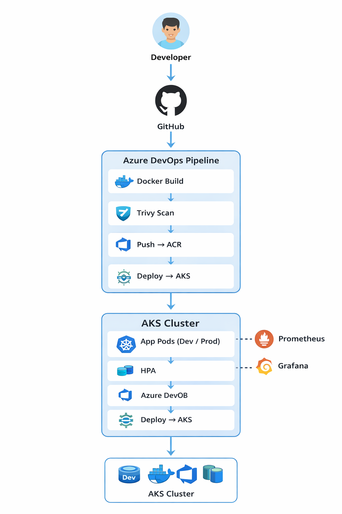
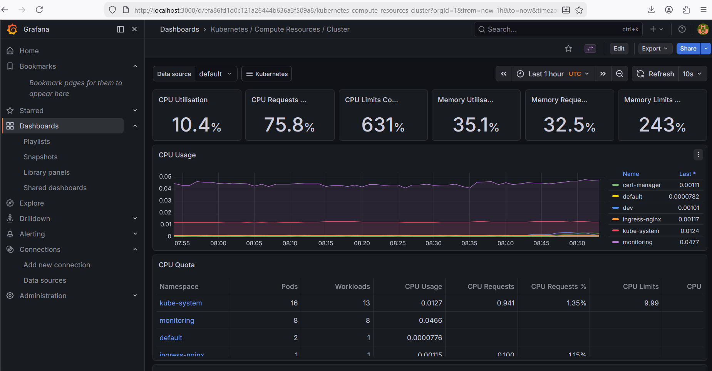

# 🚀 End-to-End DevOps Platform on Azure AKS


### CI/CD • Terraform • Trivy Security Scanning • Prometheus • Grafana • Kubernetes

This project demonstrates a **production-style DevOps platform** built on **Azure Kubernetes Service (AKS)**.

It implements a **complete CI/CD pipeline**, **container security scanning**, **monitoring**, **autoscaling**, and **infrastructure provisioning using Terraform**.

The platform deploys a **Node.js application** using **Helm** through an **Azure DevOps pipeline**.

---

# 📊 Architecture Diagram



---

# 🧭 System Architecture Overview

This platform simulates a **production-ready DevOps workflow on Microsoft Azure**.

The architecture separates **application delivery, infrastructure provisioning, security scanning, and monitoring**.

### DevOps Flow

Developer commits code → Git repository
↓
Azure DevOps pipeline triggers automatically
↓
Docker image is built and scanned using **Trivy**
↓
Secure image pushed to **Azure Container Registry (ACR)**
↓
Helm deploys the application to **Azure Kubernetes Service (AKS)**
↓
Prometheus collects cluster metrics
↓
Grafana visualizes monitoring dashboards

---

### Infrastructure Layer

Infrastructure is provisioned using **Terraform**, which creates:

* Azure Resource Group
* Azure Kubernetes Service (AKS)
* Azure Container Registry
* Azure Key Vault

---

### Application Layer

Application deployment uses:

* Docker container images
* Helm charts
* Kubernetes Deployments and Services

---

### Observability Layer

Monitoring stack includes:

* Prometheus (metrics collection)
* Grafana (dashboard visualization)
* Node Exporter
* kube-state-metrics

---

# ✨ Key Features

* CI/CD pipeline using **Azure DevOps**
* **Docker containerization**
* **Helm-based Kubernetes deployments**
* **Trivy security scanning integrated in pipeline**
* **Terraform Infrastructure as Code**
* **Prometheus + Grafana monitoring**
* **Horizontal Pod Autoscaling**
* **Azure Key Vault secret management**
* **DEV and PROD environments**
* **Manual approval before production deployments**
* **Load testing using k6**

---

# 📂 Project Structure

```text
aks-devops-project
│
├── app.js
├── Dockerfile
├── package.json
├── azure-pipelines.yml
│
├── helm-chart
│   ├── templates
│   ├── values.yaml
│   └── Chart.yaml
│
├── k8s
│   ├── hpa.yaml
│   ├── ingress.yaml
│   └── secret-provider.yaml
│
├── terraform
│   └── main.tf
│
├── docs
│   ├── architecture.png
│   └── grafana-dashboard.png
│
├── loadtest.js
└── README.md
```

---

# ⚙️ CI/CD Pipeline

The Azure DevOps pipeline automates the application lifecycle.

Pipeline stages:

1️⃣ Build Docker Image
2️⃣ Trivy Security Scan
3️⃣ Push Image to Azure Container Registry
4️⃣ Deploy to AKS DEV environment
5️⃣ Deploy to AKS PROD environment

Pipeline flow:

```
Code Push
   │
   ▼
Build Docker Image
   │
   ▼
Trivy Security Scan
   │
   ▼
Push Image → ACR
   │
   ▼
Deploy → AKS using Helm
```

---

# 📈 Monitoring Stack

Monitoring is implemented using **Prometheus and Grafana**.

Components deployed in the cluster:

* Prometheus
* Grafana
* Node Exporter
* kube-state-metrics

Grafana dashboards visualize:

* Pod CPU usage
* Memory usage
* Node health
* Kubernetes cluster metrics

---

# 📊 Monitoring Dashboard

Below is a sample **Grafana dashboard** monitoring Kubernetes metrics collected by Prometheus.



---

# 🔄 Autoscaling

The application uses **Horizontal Pod Autoscaler (HPA)** to scale pods automatically.

Example configuration:

```
minReplicas: 2
maxReplicas: 10
targetCPUUtilizationPercentage: 50
```

---

# 🧪 Load Testing

Load testing was performed using **k6**.

Example result:

```
Total Requests: 9600
Requests/sec: ~79
Failures: 0%
Average Latency: ~249ms
```

---

# 🏗️ Infrastructure as Code

Infrastructure is provisioned using **Terraform**.

Terraform provisions:

* Resource Group
* Azure Container Registry
* AKS Cluster
* Azure Key Vault

Terraform workflow:

```
terraform init
terraform plan
terraform apply
```

---

# 🔐 Security

Security practices implemented:

* Container image scanning using **Trivy**
* Secret management with **Azure Key Vault**
* TLS certificate automation using **cert-manager**
* Security checks integrated into CI/CD pipeline

---

# 🌍 Environments

Separate Kubernetes namespaces are used.

Development environment:

```
dev
```

Production environment:

```
prod
```

---

# 🛑 Production Deployment Protection

Production deployments are protected using **Azure DevOps Environments with approval checks**.

The pipeline requires **manual approval before deploying to production**, ensuring controlled and validated releases.

Deployment flow:

```
Build Image
   │
   ▼
Security Scan (Trivy)
   │
   ▼
Deploy → DEV
   │
   ▼
Approval Gate
   │
   ▼
Deploy → PROD
```

---

# 🌐 Platform Components

| Component                | Purpose                           |
| ------------------------ | --------------------------------- |
| Azure DevOps             | CI/CD pipeline automation         |
| Azure Container Registry | Docker image storage              |
| Azure Kubernetes Service | Container orchestration           |
| Helm                     | Kubernetes application deployment |
| Prometheus               | Metrics collection                |
| Grafana                  | Monitoring dashboards             |
| Trivy                    | Container vulnerability scanning  |
| Terraform                | Infrastructure provisioning       |

---

# 🎯 DevOps Capabilities Demonstrated

This project demonstrates practical DevOps skills including:

* Infrastructure as Code using Terraform
* Automated CI/CD pipelines with Azure DevOps
* Container security scanning with Trivy
* Kubernetes application deployment using Helm
* Horizontal Pod Autoscaling
* Secret management using Azure Key Vault
* Monitoring with Prometheus and Grafana
* Performance testing using k6
* Environment promotion (DEV → PROD)

---

# ▶️ Running the Application Locally

Build the container:

```
docker build -t aks-devops-app .
```

Run the container:

```
docker run -p 3000:3000 aks-devops-app
```

Open browser:

```
http://localhost:3000
```

---

# ⭐ Support

If you found this project useful, consider **starring the repository**.

It helps the project reach more DevOps learners.

---

# 👨‍💻 Author

**Pavan Kumar Gummadi**

DevOps | Cloud | Kubernetes | Azure Engineering Project
